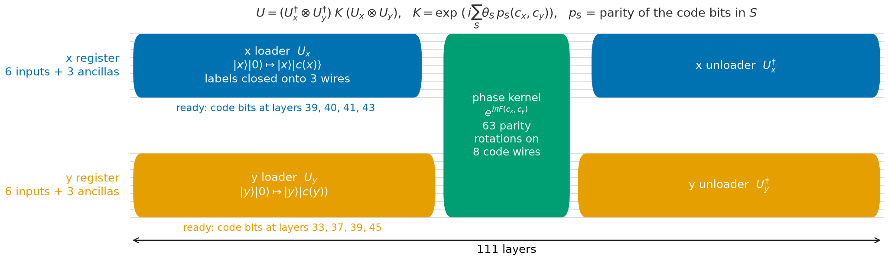
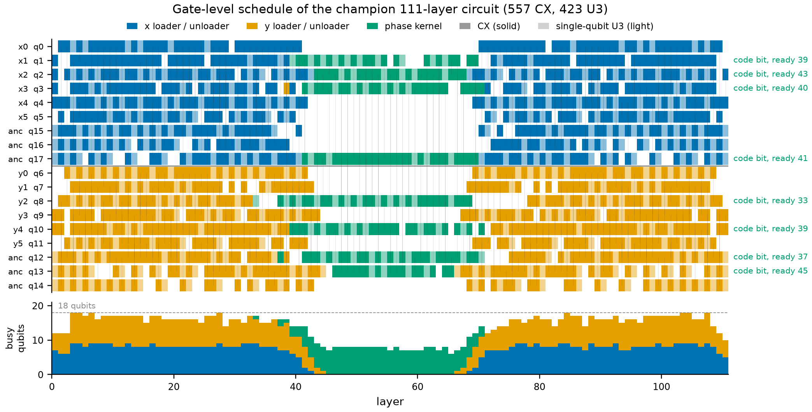
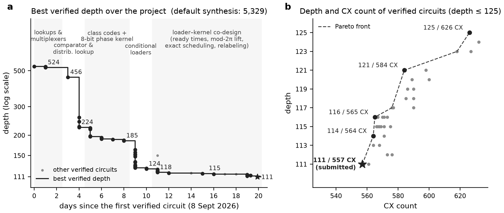

# Classiq logo phase oracle

This repository contains my entry for the 2026 Classiq Quantum Circuit Challenge: an 18-qubit U3/CX phase oracle for a 64 x 64 rendering of the Classiq logo.

The final submitted circuit has depth **111**, with **557 CX** and **423 U3** gates. I verified it on every one of the 4,096 valid basis inputs. The largest numerical error was `5.57e-14`, up to a single global phase, and all six ancillas returned to zero.

| circuit | depth | CX | U3 | verification |
|---|---:|---:|---:|---|
| [final submission](submission/submission.qasm) | **111** | **557** | 423 | all 4,096 inputs |
| [first depth-111 circuit](artifacts/111/conditional_loader_111_cx561.qasm) | 111 | 561 | 423 | all 4,096 inputs |
| [lowest-CX depth-116 circuit](artifacts/116/conditional_loader_116_cx565.qasm) | 116 | 565 | 419 | all 4,096 inputs |
| challenge baseline | 5,329 | 3,502 | - | reference notebook |

The [technical report](docs/technical-report.md) explains the construction and records the intermediate designs. Machine-readable measurements and SHA-256 hashes are in [results/verified_circuits.csv](results/verified_circuits.csv).



## How it works

The target image has only 11 distinct row patterns and 11 distinct column patterns. The circuit uses that structure instead of synthesising the full 12-bit truth table directly.

1. Each 6-bit coordinate is mapped to a 4-bit class code.
2. Two conditional loaders compute those codes on the input and ancilla wires.
3. A 63-term phase polynomial acts on the eight code bits.
4. The loaders run in reverse, returning the ancillas to zero.

The main optimisation target was the interface between the loaders and the phase kernel. A code wire can join the kernel as soon as its value is ready; it does not have to wait for the rest of its loader. This turns the middle of the circuit into a scheduling problem with a different time window for each wire.

Several ideas mattered in the final reduction:

- sparse class codes, exploiting the code words that never occur;
- conditional phase-kickback loaders;
- label functions chosen for both loader cost and kernel cost;
- an exact fused timing model for rotations at loader boundaries;
- beam search for the phase network, followed by exact MILP scheduling;
- local SAT and numerical resynthesis for the final CX reductions.



## Verify the result

The lightweight verifier needs only NumPy:

```bash
python -m pip install numpy
python scripts/verify_circuit.py submission/submission.qasm
```

Or use the Makefile:

```bash
make verify-best
make verify-all
```

`verify_circuit.py` propagates every valid input `|x, y, 0^6>` through the QASM circuit. It checks the expected sign, a common global phase, restoration of the input coordinates, and clean ancillas.

For the larger development test suite:

```bash
python -m pip install -e '.[dev]'
make test
```

## Results

The optimisation progressed through several different circuit architectures rather than one long parameter sweep.

| depth | CX | main change |
|---:|---:|---|
| 5,329 | 3,502 | challenge baseline |
| 1,046 | 903 | direct XAG compilation |
| 682 | 740 | radius-based multiplexer |
| 456 | 1,140 | comparator identity |
| 258 | 1,188 | distributed lookup |
| 218 | 897 | class codes and one phase kernel |
| 185 | 854 | scheduled kernel and exact rewrites |
| 151 | 637 | conditional loaders |
| 124 | 632 | ready-time-aware loader search |
| 118 | 585 | modulo-2pi lifts and wire freezing |
| 116 | 565 | phase freedom on unreachable code pairs |
| 115 | 566 | loader-pair search and local resynthesis |
| 114 | 564 | closing-H relabeling |
| 113 | 564 | relabeling on both coordinate registers |
| 112 | 573 | earlier y-parity target |
| **111** | **557** | sparse target supports and exact start-basis screening |

The final depth-111 schedule is tight for this particular gate list, but that is not a general lower bound. Searches for a depth-110 circuit did not produce a complete construction.



## Repository map

```text
artifacts/                 verified QASM circuits and selected reconstruction data
docs/technical-report.md   derivation, scheduling model, and experimental record
docs/figures/              generated figures used by the report
results/                   circuit measurements and hashes
scripts/verify_circuit.py  standalone NumPy verifier
src/classiq_synth/         reusable synthesis and verification code
src/post151_sa/            later-stage search and scheduling tools
submission/                the circuit and files submitted to the challenge
tests/                     regression tests for the verifier and synthesis tools
```

The repository intentionally keeps the final artifacts and the code needed to inspect them. Large search logs, solver installations, caches, and machine-specific working directories are excluded.

## Reproducibility notes

The final QASM and its exhaustive verification are directly reproducible with the command above. Re-running every search is a separate task: some searches used compiled C programs, HiGHS, SAT solvers, Qiskit, pytket, and long randomised runs. The technical report distinguishes verified circuit results from unsuccessful or time-limited searches.

## License and citation

The code is available under the [MIT License](LICENSE). If this repository is useful in academic work, citation metadata is provided in [CITATION.cff](CITATION.cff).
