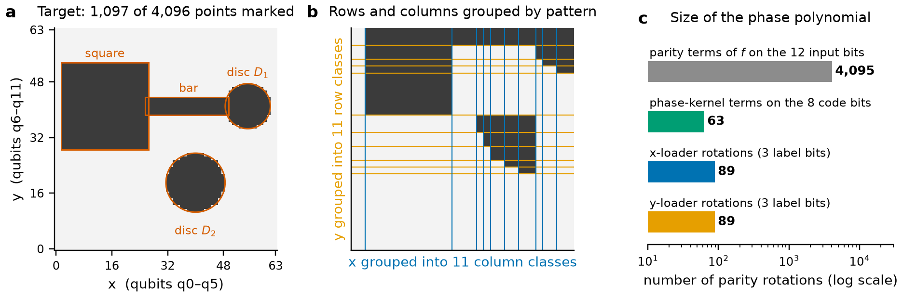
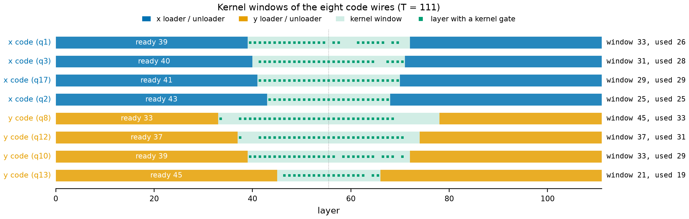
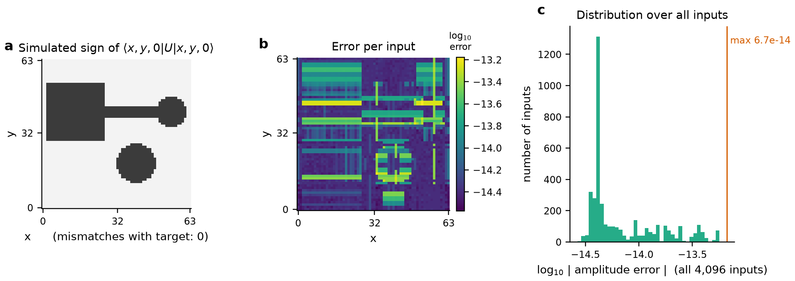

# A depth-111 phase oracle for the Classiq logo

**Class codes, conditional loaders and exact scheduling on 18 qubits**

Monit Sharma · September 2026

---

## Abstract

We describe an 18-qubit circuit over the gate set {U3, CX} that implements the phase oracle of the Classiq Quantum Circuit Challenge. The oracle multiplies each basis state $|x, y\rangle$ of two 6-bit coordinates by $-1$ exactly when $(x, y)$ is a black pixel of a 64 × 64 rendering of the Classiq logo. The final submitted circuit has **depth 111 with 557 CX and 423 U3 gates**. The notebook provided with the challenge produces depth 5,329 with 3,502 CX, so the submitted circuit is 48 times shallower. Every reported circuit is verified exhaustively on all 4,096 clean-ancilla basis inputs, up to one shared global phase and with the ancillas restored to zero; the largest deviation for the final circuit is $5.57 \times 10^{-14}$.

The construction has three parts:

- Each coordinate is compressed into a 4-bit class code.
- Two *conditional loaders* write the class codes into ancilla-backed wires.
- A 63-term phase polynomial on the 8 code bits applies the sign. The loaders are then run in reverse.

Most of the depth reduction came from treating the loader–kernel interface as the object to optimise. The construction tracks when each code wire becomes available instead of using loader depth alone, loads labels only modulo $2\pi$, and schedules the complete circuit with integer programming. Later reductions came from relabeling code wires at their closing Hadamards, choosing sparse target functions, screening loader pairs by their exact start basis, and resynthesising small blocks. The final section records the limits of the search for depth 110; those results are search outcomes, not a general lower bound.

---

## 1. The problem

The challenge ([Classiq, 2026](https://www.classiq.io/challenge)) asks for a circuit on at most 18 qubits that implements

$$
|x, y\rangle\,|0^6\rangle \;\longmapsto\; e^{i\phi}\,(-1)^{f(x,y)}\,|x, y\rangle\,|0^6\rangle ,
$$

- **Registers.** $x$ lives on qubits q0–q5 and $y$ on q6–q11, little-endian. Qubits q12–q17 are ancillas.
- **Global phase.** $\phi$ must be the same for every input.
- **Target function.** $f(x, y) = 1$ on the union of four shapes: a square $2 \le x \le 26,\ 29 \le y \le 53$; a bar $26 \le x \le 49,\ 39 \le y \le 43$; and two discs, $(x-55)^2 + (y-41)^2 \le 42$ and $(x-40)^2 + (y-19)^2 \le 72$ (Fig. 1a). Of the 4,096 points, 1,097 are marked.
- **Gates.** The circuit must be expressed in U3 and CX with all-to-all connectivity.
- **Scoring.** Submissions are ranked by depth. CX count breaks ties.

In this report, depth is the number of layers in an as-soon-as-possible schedule in which every layer contains gates on disjoint qubits. Single-qubit gates count as a layer.

**Why the problem is hard.** A diagonal unitary is a phase polynomial: $(-1)^{f} = \exp(i\pi f)$, and $f$ can be expanded in parities of the input bits. For this $f$ the expansion is dense. All 4,095 non-constant parities of the 12 input bits appear with nonzero weight (Fig. 1c). Synthesising that polynomial directly with Gray-code or phase-gadget methods ([Welch et al., 2014](https://arxiv.org/abs/1306.3991); [Amy, Azimzadeh & Mosca, 2018](https://arxiv.org/abs/1712.01859); [Cowtan et al., 2020](https://arxiv.org/abs/1906.01734)) needs thousands of rotations. On 18 wires that means a depth in the hundreds at best.

Generic lower bounds are weak here. Viewed as a 64 × 64 matrix, $(-1)^{f(x,y)}$ has rank 11, so any circuit needs at least $\lceil \log_2 11 \rceil = 4$ CX gates between the x and y halves. The real difficulty is engineering depth, not a counting obstruction.



**Figure 1.** *(a)* The target predicate on the 64 × 64 grid and the four shapes that define it. *(b)* The same matrix with rows and columns reordered so that identical rows (and identical columns) are adjacent. There are only 11 distinct rows and 11 distinct columns. *(c)* Number of parity rotations needed to write the phase directly on the 12 input bits, compared with the phase kernel on the 8 code bits and the two loaders used here.

---

## 2. Structure of the target

The logo is a union of axis-aligned rectangles and two discs, so its matrix has very few distinct rows and columns. We call two x values equivalent when their columns of the image are identical, and likewise for y. There are **11 column classes and 11 row classes**, and the 0/1 matrix has rank 10 over both GF(2) and the reals (Fig. 1b).

The sign therefore depends on $(x, y)$ only through the pair (column class of $x$, row class of $y$). The architecture exploits this in two steps.

1. **Class codes.** Each coordinate is mapped to a 4-bit code $c = (p, L)$.
   - $p$ is a raw input parity: $p_x = x_4 \oplus x_5$ and $p_y = y_5$.
   - $L$ is a 3-bit label assigned to each (parity, class) pair.
   - Labels are chosen so that $(p, L)$ determines the class, and the resulting code has as few kernel terms as possible.
   - The x code takes 14 of its 16 possible values and the y code 13. So only 182 of the 256 code pairs ever occur.
2. **An 8-bit kernel.** There is a Boolean function $F$ on 8 bits with $f(x, y) = F(c(x), c(y))$ for every input. Because 74 code pairs are unreachable, $F$ is free on them. We choose those values to make the parity expansion of $F$ sparse. The best completion we found has **63 parity terms** instead of 4,095.

The label assignment was chosen by simulated annealing ([Kirkpatrick, Gelatt & Vecchi, 1983](https://doi.org/10.1126/science.220.4598.671)). It trades the number of kernel terms against an estimate of loader cost ([`artifacts/185/class_codes.json`](../artifacts/185/class_codes.json)).

---

## 3. Circuit architecture

The circuit has the form

$$
U \;=\; \big(U_x^{\dagger} \otimes U_y^{\dagger}\big)\; K \;\big(U_x \otimes U_y\big), \qquad
K = \exp\Big(i \sum_{S} \theta_S\, p_S(c_x, c_y)\Big),
$$

where $p_S$ is the parity of the code bits in $S$ and the sum runs over 63 sets $S$.

- **Loaders.** $U_x$ acts on the six x qubits and three ancillas and maps $|x\rangle|000\rangle \mapsto |x\rangle|L_x(x)\rangle$. The parity $p_x$ is kept on an input wire. $U_y$ does the same for y.
- **Kernel.** The kernel $K$ acts on the eight code wires only.
- **Unloaders.** The unloaders are the exact inverses of the loaders. Any phase the loaders pick up as a function of the inputs alone is therefore cancelled.

Figure 2 shows the layout and Figure 3 the gate-level schedule of the final circuit.


**Figure 2.** The compute–phase–uncompute structure. Each register holds six inputs and three ancillas. The loaders finish their four code bits at different times. Each code wire joins the phase kernel as soon as its loader has finished with it.

### 3.1 Loaders: labels by phase kickback

A label bit is written onto a target wire $t$ in three steps:

1. Open the target with a Hadamard gate.
2. Apply a diagonal phase whose value, relative between the two branches of the target, equals $\pi L(x)$.
3. Close the target with a second Hadamard.

The diagonal phase is realised by Z rotations on parities $t \oplus (s \cdot x)$. So the loader is itself a phase polynomial between two Hadamard layers, in the spirit of uniformly controlled rotations ([Möttönen et al., 2004](https://arxiv.org/abs/quant-ph/0407010); [Bergholm et al., 2005](https://arxiv.org/abs/quant-ph/0410066)) and table lookup ([Babbush et al., 2018](https://arxiv.org/abs/1805.03662)).

Four refinements took the loaders from about 77 layers to 44–45.

**Conditional (cofactor) loading.** The second and third targets are loaded *given* the first label, which is already present on a wire. The rotations for these targets may use parities that include the first label. They only need to be correct on the combinations of $x$ and $L_0$ that actually occur. This is a Shannon/BDD-style cofactor decomposition ([Bryant, 1986](https://doi.org/10.1109/TC.1986.1676819)) implemented in the phase domain.

- The rotation supports drop from roughly 170 per side to 45 + 21 + 23 = 89 for x and 45 + 30 + 14 = 89 for y.
- All three targets open in layer 1 and overlap in time. Only rotations that need a still-open label must wait for it.
- A label may be closed onto any wire, not only an ancilla. The omitted restoring CX gates commute through the closing Hadamard into diagonal gates. The mirrored unloader cancels those gates.

**Output bases.** The three targets do not have to hold $L_0, L_1, L_2$ themselves; any invertible combination works. The x loader computes $(L_0, L_1, L_1 \oplus L_2)$ and the y loader $(L_0, L_1, L_2)$. We chose these bases because they minimise loader cost and kernel terms together.

**Modulo-$2\pi$ lift.** The relative phase has to equal $\pi L(x)$ only modulo $2\pi$. For the unconditional target, the exact equation $A a = \pi L$ has a unique solution: the Walsh spectrum of $L$.

- Allowing $\pi L + 2\pi k(x)$ for any integer $k$ turns this into a search for the sparsest Walsh spectrum of $L + 2k$.
- With 6-bit angles, the constraints form a linear system over $\mathbb{Z}/64$. The coefficients that can be removed form a hyperplane: half of the 64.
- We solve the system in Howell normal form ([Howell, 1986](https://doi.org/10.1080/03081088608817705); [Storjohann & Mulders, 1998](https://doi.org/10.1007/3-540-68530-8_12)). Ordinary echelon form is not enough modulo a prime power.
- This removed one or two rotations per target, which was needed to fit the loaders into 44 and 45 layers.

**Search.** The loaders are built by a layer-synchronous beam search. Each layer is a matching of CX gates on the nine wires of one side. A rotation fires as soon as some wire holds its parity.

- **Objective.** The search minimises the vector of *ready times* of the four code wires, not the loader depth (Section 3.3).
- **Freeze action.** An action retires a wire once its row is a code vector. The action is legal only if every rotation still pending lies in the span of the other wires, which is a hyperplane test on the row space.
- **Polish.** Simulated-annealing passes over the CX sequence tidy up the result.

### 3.2 Phase kernel

The kernel applies the 63 phase terms $\theta_S$ on the eight code wires. It is a CX + Rz network: CX gates move each wire through a sequence of parities, a rotation is placed whenever a wire holds a required parity, and every wire must end in its starting parity.

We schedule this network with a beam search in which each code wire has its own time window (next section). The search can finish in a permutation of the code wires when the unloader is relabelled to match. The final circuit's kernel uses 79 CX and 62 single-qubit gates (Table 2).

The phase function itself is free on the 74 unreachable code pairs (Section 2). Several completions reach 63 terms, and they differ in how well they schedule. The circuits reported here use the one that gave the best kernels (`kernel_co.npy`).

### 3.3 The loader–kernel interface

Because the unloader mirrors the loader, a code wire whose loader finishes at layer $r$ is busy in layers $1..r$ and again in layers $T-r+1..T$. It is available to the kernel only in the window

$$
r + 1 \;\le\; t \;\le\; T - r .
$$

Two consequences shaped the whole project.

1. **Only ready times matter.** For given loaders, depth $T$ is feasible exactly when the kernel can be scheduled inside these windows. So the quantity to optimise is the *vector* of ready times of the eight code wires; loader depth is irrelevant as long as it is at most $T/2$. Two loaders of equal depth can differ by many layers in the windows they leave. Which code bit arrives last also matters, because the eight code bits take part in very different numbers of kernel terms.
2. **Timing rules for kernel rotations.** A kernel rotation needs the wire to hold the right parity. It does not need the loader to be finished with the wire. We describe the placement rules with an exact *fused model*:
   - A rotation may share a layer with the closing Hadamard of a target, because the two fuse into one U3.
   - A rotation may not sit in a layer where a loader or unloader CX uses the wire.
   - A rotation may move earlier than the loader's last gate on a wire when that gate commutes with it ("rotation pull-in").

   Replacing an optimistic model with this exact one removed a long series of candidates that looked feasible in the model and then failed after assembly.



**Figure 4.** Kernel windows in the depth-111 circuit. Blue and orange bars show layers taken by the loader and mirrored unloader; light green shows the interval available to the kernel. Squares mark layers in which the kernel acts on a wire. The latest x and y code bits are ready at layers 43 and 45, leaving windows of 25 and 21 layers.

### 3.4 Relabeling at the closing Hadamard and sparse targets

**Identity.** Let target wire $A$ close with a Hadamard and let the kernel's first gate on $A$ be $\mathrm{CX}(B \to A)$. Then
$\mathrm{CX}_{B\to A}\,H_A = H_A\,\mathrm{CZ}_{BA}$, so the CX may be replaced by a CZ *before* the closing Hadamard. Before the
Hadamard, $A$ is in the phase-kickback frame: its two branches carry relative phase $\pi L(x)$. A CZ with a wire holding the
bit $b$ multiplies the $|1\rangle$ branch by $(-1)^{b}$, so the relative phase becomes $\pi(L \oplus b)$ and $A$ closes onto the
label $L \oplus b$. The mirrored statement holds at the unloader's opening Hadamard. In short: **a conditional target may load
$L \oplus b$ instead of $L$** for any bit $b$ that its rotations may already depend on (for x target 1: $L_0$, $p_x$ or both).

**Why it matters.** The kernel's start (and home) rows change: the late x code wire now carries $L_1 \oplus L_0$. The kernel
phase polynomial is the same function of the labels, but its CX network starts from a different basis. In the fused exact model
this is enough for the kernel to fit the unchanged windows at T = 114 (kernel beam, W = 12000: feasible for
$L_1 \oplus L_0$; 17 terms short for $L_1 \oplus p_x$). No loader timing had to improve.

**Realising it for free.** Loading $L_1 \oplus L_0$ means adding $\pi L_0(x)$ to target 1's relative phase modulo $2\pi$. We solve
$A_S\,\Delta = \pi(L_0 + 2k)$ for angle changes $\Delta$ on a dictionary $S$ made of the target's existing rotations plus every
target parity that some wire holds in an *idle* layer of the existing schedule, with integer lifts $k$ (a small MILP,
`relabel.py`). For the x loader of the 115 circuits two angles change and one rotation is added in an idle slot (layer 33,
wire 4). The CX/H schedule, the per-wire profile and the CX count are unchanged, and the unloader is the exact inverse of the
new loader, so all loader-only phases still cancel. The new loader is checked exactly against the modified label code.
Target 2 can similarly load $L_1 \oplus L_2 \oplus L_0 \oplus p_x$ (18 angles change); this second relabel lowers the kernel CX
count. Relabels of target 0 are avoided because the other targets condition on its label.

**Result.** Assembly, CX cancellation and the exact MILP first gave 114 / 571 CX; a second relabel and local resynthesis reduced this to 114 / 564. Extending the relabeling to both coordinate registers gave depth 113. An earlier y-parity target then gave depth 112. For the final depth-111 circuit, the target functions were selected for sparse rotation support and candidate loader pairs were screened against their exact kernel start bases before the full beam search. These changes produced a 561-CX circuit, followed by two local resynthesis steps to 558 and 557 CX.

### 3.5 Exact scheduling and local optimisation

Assembling loaders, kernel and unloaders gives a circuit whose depth depends on how commuting gates are ordered. We apply four passes.

1. **Commutation-aware CX cancellation.** Adjacent CX pairs are cancelled after commuting gates past each other. Neighbouring single-qubit gates are fused into one U3.
2. **Exact rescheduling.** A time-indexed mixed-integer program assigns every gate to a layer.
   - Each gate is placed exactly once.
   - Each wire carries at most one gate per layer.
   - Gates that do not commute keep their order.
   - The depth is fixed to a target $T$.

   The program is solved with HiGHS ([Huangfu & Hall, 2018](https://doi.org/10.1007/s12532-017-0130-5)). It certifies whether a given gate list fits in $T$ layers, and every reported depth has passed it.
3. **SAT peephole on the kernel.** We slide a window of 6 kernel layers over the interior of the kernel. Each window is re-synthesised with a SAT encoding (solved by Kissat, [Biere et al.](https://github.com/arminbiere/kissat)) that keeps the boundary parities and rotations fixed and asks for one CX fewer. One window improved (17 → 16 CX), giving 568 CX at depth 115.
4. **Depth-aware numerical resynthesis.** We enumerate convex three-qubit blocks of the circuit, including blocks that contain a non-diagonal U3, which phase-polynomial methods cannot rewrite.
   - For each block we try every CX sequence with fewer CX than the block has. We fit the single-qubit gates numerically (BFGS, then Levenberg–Marquardt to $10^{-15}$).
   - We replace as many single-qubit slots as possible by nothing, Rz or Rx, so that they commute through neighbouring gates.
   - A candidate is kept only if the exact scheduler preserves the target depth.
   - One block, on q9, q11 and q13, went from 4 CX to 3, giving 567 CX. This mirrors the block-resynthesis step of GUOQ ([Xu et al., 2025](https://arxiv.org/abs/2411.04104)) and QSearch ([Davis et al., 2020](https://ieeexplore.ieee.org/document/9259942)), with depth rather than gate count as the acceptance test.

   About 280 other exact fewer-CX substitutions exist in the circuit, but every one of them pushes the depth to 116 or more.

---

## 4. Results

### 4.1 Final circuits

**Table 1.** Selected verified circuits at depths 111–116. All have width 18 and pass the exhaustive check (Section 5). The complete list is in [`results/verified_circuits.csv`](../results/verified_circuits.csv).

| Depth | CX | U3 | Circuit | What changed |
|---:|---:|---:|---|---|
| **111** | **557** | 423 | [`conditional_loader_111_cx557.qasm`](../artifacts/111/conditional_loader_111_cx557.qasm) | sparse target supports, exact start-basis screen and local resynthesis (submitted) |
| 111 | 561 | 423 | [`conditional_loader_111_cx561.qasm`](../artifacts/111/conditional_loader_111_cx561.qasm) | first complete depth-111 construction |
| 112 | 573 | 424 | [`conditional_loader_112_cx573.qasm`](../artifacts/112/conditional_loader_112_cx573.qasm) | early y-parity target and loader/kernel resynthesis |
| 113 | 564 | 424 | [`conditional_loader_113_cx564.qasm`](../artifacts/113/conditional_loader_113_cx564.qasm) | relabeling on both coordinate registers and local resynthesis |
| 114 | 564 | 421 | [`conditional_loader_114_cx564.qasm`](../artifacts/114/conditional_loader_114_cx564.qasm) | closing-H relabeling and numerical resynthesis |
| 114 | 571 | 419 | [`conditional_loader_114_cx571.qasm`](../artifacts/114/conditional_loader_114_cx571.qasm) | first depth-114 circuit: x target 1 loads $L_1 \oplus L_0$ |
| 115 | 566 | 418 | [`conditional_loader_115_cx566.qasm`](../artifacts/115/conditional_loader_115_cx566.qasm) | kernel-suffix SAT, then a numerical 3-qubit block |
| 115 | 567 | 418 | [`conditional_loader_115_cx567.qasm`](../artifacts/115/conditional_loader_115_cx567.qasm) | numerical 3-qubit block resynthesis of the 568 circuit |
| 115 | 568 | 418 | [`conditional_loader_115_cx568.qasm`](../artifacts/115/conditional_loader_115_cx568.qasm) | SAT peephole on one kernel window of the 569 circuit |
| 115 | 569 | 418 | [`conditional_loader_115_cx569.qasm`](../artifacts/115/conditional_loader_115_cx569.qasm) | lower-CX loaders with the same ready-time profile |
| 115 | 571 | 418 | [`conditional_loader_115_cx571.qasm`](../artifacts/115/conditional_loader_115_cx571.qasm) | lower-CX loader variants |
| 115 | 575 | 418 | [`conditional_loader_115.qasm`](../artifacts/115/conditional_loader_115.qasm) | first depth-115 circuit (initial submission) |
| 116 | 565 | 419 | [`conditional_loader_116_cx565.qasm`](../artifacts/116/conditional_loader_116_cx565.qasm) | new y loader; exact rotation model |
| 116 | 573 | 420 | [`conditional_loader_116.qasm`](../artifacts/116/conditional_loader_116.qasm) | first depth-116 circuit (phase freedom on unreachable codes) |

**Table 2.** Gate counts of the final 111 / 557 circuit by stage. Gates are attributed using the kernel windows of Figure 4.

| Stage | CX | U3 |
|---|---:|---:|
| x loader | 120 | 91 |
| y loader | 120 | 90 |
| phase kernel | 79 | 62 |
| x unloader | 119 | 91 |
| y unloader | 119 | 89 |
| **total** | **557** | **423** |


**Figure 3.** Gate-level schedule of the 111 / 557 circuit. Rows are qubits: the x register (inputs x0–x5 and its three ancillas), then the y register. Solid cells are CX gates and light cells single-qubit gates; thin vertical lines connect the two qubits of each CX. The lower panel counts the busy qubits in each layer.

### 4.2 How the depth came down

The depth fell in five architectural stages (Fig. 5a, Table 3). Most of the later gains came from scheduling and from the loader–kernel interface rather than from new gate identities.


**Figure 5.** *(a)* Best verified depth over the course of the project (log scale). Every point is a complete circuit that passed the exhaustive check. The Classiq baseline notebook (depth 5,329) is off the top of the axis. *(b)* Depth and CX count of all verified circuits with depth at most 125. The line joins the Pareto-optimal ones.

**Table 3.** Selected milestones. Dates are when each circuit was first committed.

| Depth | CX | Date | Idea that produced it |
|---:|---:|---|---|
| 5,329 | 3,502 | — | Classiq baseline notebook (rectangle cover, high-level synthesis) |
| 524 | 950 | 9 Sep | six-feature affine multiplexer with peephole optimisation |
| 456 | 1,140 | 11 Sep | logo written as two comparisons of 3-bit "levels"; shared multiplexers |
| 258 | 1,188 | 12 Sep | distributed lookup: phases placed on temporarily borrowed coordinate wires |
| 243 | 971 | 12 Sep | class codes and a single 8-wire phase kernel |
| 196 | 858 | 13 Sep | beam-search schedule for the kernel |
| 185 | 854 | 16 Sep | 63-term kernel, exact three-wire CNOT rewrites |
| 151 | 637 | 17 Sep | conditional (cofactor) loaders with overlapping frames |
| 124 | 632 | 18 Sep | loaders optimised for ready times; windowed kernel beam |
| 118 | 585 | 20 Sep | freeze action, modulo-$2\pi$ lift, blocked-term weighting |
| 117 | 576 | 22 Sep | rotation pull-in; exact MILP rescheduling |
| 116 | 565 | 24 Sep | phase freedom on unreachable codes; exact rotation model |
| 115 | 566 | 26 Sep | asymmetric loader pair, fused exact model, SAT and numerical peepholes |
| 114 | 564 | 27 Sep | relabeling of the late x code wires at their closing Hadamards; numerical peepholes |
| 113 | 564 | 27 Sep | relabeling on both coordinate registers |
| 112 | 573 | 27 Sep | early y-parity target |
| **111** | **557** | 27 Sep | sparse target supports, exact start-basis screening and local resynthesis |

---

## 5. Verification

A circuit is accepted only after an exhaustive check.

- **Coverage.** Each of the 4,096 inputs $|x, y, 0^6\rangle$ is propagated through the circuit as a sparse state vector. For these circuits a basis state never spreads over more than 64 amplitudes, so all inputs take about one second.
- **Criterion.** For every input, the output must equal $e^{i\phi}(-1)^{f(x,y)}|x, y, 0^6\rangle$, with a single $\phi$ fixed by the first input. We report the largest amplitude deviation over all inputs, which also bounds any leakage into nonzero ancilla states.
- **Superpositions.** By linearity, the check covers every superposition of clean-ancilla inputs.
- **Record.** Each circuit's SHA-256 is recorded next to its report.

Two independent implementations perform this check:

- the repository's Qiskit-based verifier ([`src/exhaustive_verify.py`](../src/exhaustive_verify.py));
- a standalone numpy verifier with its own QASM parser ([`scripts/verify_circuit.py`](../scripts/verify_circuit.py)).

For the headline circuits we also compare dense random superpositions against the previous best circuit with Qiskit Aer ([Javadi-Abhari et al., 2024](https://arxiv.org/abs/2405.08810)).



**Figure 6.** Exhaustive verification of the final circuit. *(a)* Sign of the simulated diagonal. It matches the target at all 4,096 points. *(b)* Amplitude error per input. *(c)* Error distribution over all inputs. The largest error is $5.57 \times 10^{-14}$.

---

## 6. Limits of the depth-110 search

We did not find a depth-110 circuit, and we cannot prove that none exists. The final depth-111 circuit has a tight per-wire path of 45 loader layers, 21 kernel touches and 45 unloader layers. Exact rescheduling proves only that this particular gate list does not fit in 110 layers.

The remaining bottleneck is joint: the nonlinear class-code bits must become available early enough, the kernel must use them within narrow windows, and the unloaders need the same space in reverse. Searches that changed only the phase network or only one loader repeatedly ran out of room on another wire. Alternative class codes could shorten the kernel, but the encoders found for those codes were too slow to improve the complete circuit.

The search covered exact rescheduling of the final gate lists, bounded SAT synthesis of loader tails and local windows, and large heuristic searches for alternative loaders and code assignments. Some bounded instances were proved infeasible; others timed out. None of these experiments rules out a different circuit architecture.

**Lower bounds.** Generic bounds are far below 111. The rank argument of Section 1 gives only four CX across the x | y cut, so the gap between 111 and the true optimum is unknown. The failed loader, kernel and SAT searches recorded during the project narrow specific constructions, not the full circuit space.

---

## 7. Related work

- **Diagonal unitaries and phase polynomials.** These have a long history: Gray-code and Walsh constructions ([Welch et al., 2014](https://arxiv.org/abs/1306.3991)), CNOT-optimal parity networks ([Amy, Azimzadeh & Mosca, 2018](https://arxiv.org/abs/1712.01859)), phase gadgets ([Cowtan et al., 2020](https://arxiv.org/abs/1906.01734)), T-depth and rotation merging ([Amy, Maslov & Mosca, 2014](https://arxiv.org/abs/1303.2042)), and optimal CNOT synthesis for linear maps ([Patel, Markov & Hayes, 2008](https://arxiv.org/abs/quant-ph/0302002)). These methods treat the phase function as given. Our main lever was to change the function, through the class code, the unreachable-code freedom and the modulo-$2\pi$ lift, before synthesis.
- **Loading data.** Computing a function of an address into ancillas is table lookup ([Babbush et al., 2018](https://arxiv.org/abs/1805.03662)) and uniformly controlled rotations ([Möttönen et al., 2004](https://arxiv.org/abs/quant-ph/0407010)). Phase-tolerant loading, where phases cancelled by a later inverse may be ignored, appears in [Seidel et al. (2023)](https://arxiv.org/abs/2110.07545). Conditionally clean ancillas are discussed by [Khattar & Gidney (2025)](https://arxiv.org/abs/2407.17966).
- **Circuit optimisation.** Rewrite-and-resynthesis optimisers such as GUOQ ([Xu et al., 2025](https://arxiv.org/abs/2411.04104)) and numerical synthesis tools such as QSearch/BQSKit ([Davis et al., 2020](https://ieeexplore.ieee.org/document/9259942)) usually target gate counts. Here the acceptance criterion is exact depth, checked with an integer program after every change.
- **Asymptotic constructions.** Recent asymptotic results for Boolean oracles ([Nie & Zi, 2026](https://arxiv.org/abs/2607.28402)) and diagonal unitaries ([arXiv:2606.17589](https://arxiv.org/abs/2606.17589)) concern growing $n$. At $n = 12$ with six ancillas their constructions are much deeper than the circuit presented here.

---

## 8. Reproducing the results

```sh
python scripts/verify_circuit.py submission/submission.qasm                         # numpy only
make verify-best                                                                    # final circuit
python scripts/collect_results.py --verify                                          # re-verify every milestone
python scripts/make_figures.py                                                      # regenerate docs/figures
```

Selected reconstruction data for the final circuit is in [`artifacts/111/recipes/`](../artifacts/111/recipes/):

- the loader descriptions (`.pkl`);
- the phase coefficients (`kernel_co.npy`);
- the kernel schedules.

The search code is in [`src/post151_sa/`](../src/post151_sa/). The beam searches are written in C and the scheduling and verification in Python.

---

## References

1. Classiq. *Quantum Circuit Challenge* (2026). https://www.classiq.io/challenge
2. J. Welch, D. Greenbaum, S. Mostame, A. Aspuru-Guzik. Efficient quantum circuits for diagonal unitaries without ancillas. *New J. Phys.* 16, 033040 (2014). [arXiv:1306.3991](https://arxiv.org/abs/1306.3991)
3. M. Amy, P. Azimzadeh, M. Mosca. On the CNOT-complexity of CNOT-phase circuits. *Quantum Sci. Technol.* 4, 015002 (2018). [arXiv:1712.01859](https://arxiv.org/abs/1712.01859)
4. A. Cowtan, S. Dilkes, R. Duncan, W. Simmons, S. Sivarajah. Phase gadget synthesis for shallow circuits. *EPTCS* 318 (2020). [arXiv:1906.01734](https://arxiv.org/abs/1906.01734)
5. M. Amy, D. Maslov, M. Mosca. Polynomial-time T-depth optimization of Clifford+T circuits via matroid partitioning. *IEEE TCAD* 33, 1476 (2014). [arXiv:1303.2042](https://arxiv.org/abs/1303.2042)
6. K. N. Patel, I. L. Markov, J. P. Hayes. Optimal synthesis of linear reversible circuits. *Quantum Inf. Comput.* 8, 282 (2008). [arXiv:quant-ph/0302002](https://arxiv.org/abs/quant-ph/0302002)
7. M. Möttönen, J. J. Vartiainen, V. Bergholm, M. M. Salomaa. Transformation of quantum states using uniformly controlled rotations. *Quantum Inf. Comput.* 5, 467 (2005). [arXiv:quant-ph/0407010](https://arxiv.org/abs/quant-ph/0407010)
8. V. Bergholm, J. J. Vartiainen, M. Möttönen, M. M. Salomaa. Quantum circuits with uniformly controlled one-qubit gates. *Phys. Rev. A* 71, 052330 (2005). [arXiv:quant-ph/0410066](https://arxiv.org/abs/quant-ph/0410066)
9. R. Babbush et al. Encoding electronic spectra in quantum circuits with linear T complexity. *Phys. Rev. X* 8, 041015 (2018). [arXiv:1805.03662](https://arxiv.org/abs/1805.03662)
10. R. E. Bryant. Graph-based algorithms for Boolean function manipulation. *IEEE Trans. Comput.* C-35, 677 (1986). [doi:10.1109/TC.1986.1676819](https://doi.org/10.1109/TC.1986.1676819)
11. J. A. Howell. Spans in the module $(\mathbb{Z}_m)^s$. *Linear Multilinear Algebra* 19, 67 (1986). [doi:10.1080/03081088608817705](https://doi.org/10.1080/03081088608817705)
12. A. Storjohann, T. Mulders. Fast algorithms for linear algebra modulo N. *ESA 1998*, LNCS 1461. [doi:10.1007/3-540-68530-8_12](https://doi.org/10.1007/3-540-68530-8_12)
13. S. Kirkpatrick, C. D. Gelatt, M. P. Vecchi. Optimization by simulated annealing. *Science* 220, 671 (1983). [doi:10.1126/science.220.4598.671](https://doi.org/10.1126/science.220.4598.671)
14. Q. Huangfu, J. A. J. Hall. Parallelizing the dual revised simplex method. *Math. Prog. Comp.* 10, 119 (2018). [doi:10.1007/s12532-017-0130-5](https://doi.org/10.1007/s12532-017-0130-5)
15. A. Biere et al. Kissat SAT solver. https://github.com/arminbiere/kissat
16. A. Xu, A. Molavi, S. Tannu, A. Albarghouthi. Optimizing quantum circuits, fast and slow. *ASPLOS 2025*. [arXiv:2411.04104](https://arxiv.org/abs/2411.04104)
17. M. G. Davis, E. Smith, A. Tudor, K. Sen, I. Siddiqi, C. Iancu. Towards optimal topology aware quantum circuit synthesis. *IEEE QCE 2020*. [IEEE Xplore](https://ieeexplore.ieee.org/document/9259942)
18. R. Seidel et al. Automatic generation of Grover quantum oracles for arbitrary data structures. *Quantum Sci. Technol.* 8, 025003 (2023). [arXiv:2110.07545](https://arxiv.org/abs/2110.07545)
19. T. Khattar, C. Gidney. Rise of conditionally clean ancillae for efficient quantum circuit constructions. *Quantum* 9, 1752 (2025). [arXiv:2407.17966](https://arxiv.org/abs/2407.17966)
20. J. Nie, W. Zi. Nearly optimal quantum circuits for Boolean oracles (2026). [arXiv:2607.28402](https://arxiv.org/abs/2607.28402)
21. Asymptotically optimal circuit depth for diagonal unitary synthesis and compilation on two-dimensional grids (2026). [arXiv:2606.17589](https://arxiv.org/abs/2606.17589)
22. A. Javadi-Abhari et al. Quantum computing with Qiskit (2024). [arXiv:2405.08810](https://arxiv.org/abs/2405.08810)
